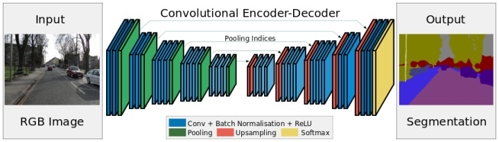
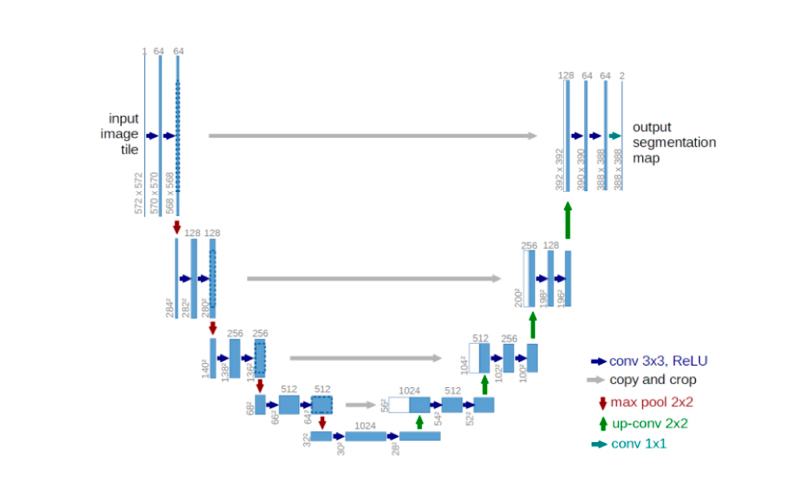
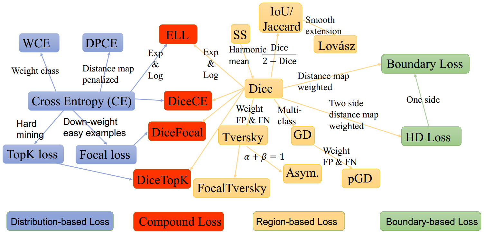
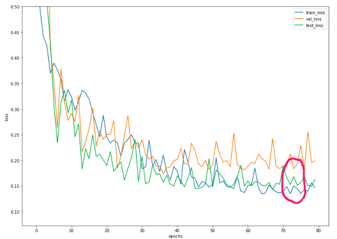

# *Изучение архитектур нейросетей для задачи сегментации*
***
В данной работе было изучено применение различных принципов архитектур нейросетей (и их вариаций) и функций потерь для сегментации поражений кожи на датасете [ADDI Project](https://www.fc.up.pt/addi/ph2%20database.html) 

### **Архитектуры:**
- **SegNet.**
 Основной особенностью является сохранение и "пробрасывание" индексов из слоёв maxpool в энкодере в слои unpool в декодере. Таким образом, в этих слоях для изменения размеров сверток появляются параметры.


- **UNet.**
 Здесь основной идеей являются skip-connections.
 

-  **UNet2. **По сравнению c Unet в энкодере заменили maxpooling на conv(stride=2), в декодере интерполяцию(nearestneighboor) на convtranspose. 
 Как это работает можно посмотреть [тут](https://github.com/vdumoulin/conv_arithmetic/blob/master/README.md) 

- **DilatedUnet.** В Unet2 установили в down/upsampling слоях параметр dilation = 2. В предыдущей ссылке показано, чем  dilated свертки отличаются от обычных: в целом, мы увеличиваем receptive field фильтра, не увеличивая число его параметров.
***

### Loss functions и метрика
Все разнообразие функций потерь для задач сегментации представлено структурно на картинке:


В этой работе были использованы следующие:
1. **BCE** (CE на картинке) - бинарная кросс-энтропия;
2. **Focal** - модифицированная версия кросс-энтропии, которая заставляет сеть лучше оучаться на "сложных" примерах;
3. **Dice** - лосс  функция, основанная на пересечении целевой и предсказанной масок.
4. **Tversky** - взвешенная версия Dice, позволяет изменять цену ошибок FP и FN.
5. **Combo** -  составной лосс (focal+dice)
Более подробно с примерами реализации эти и другие лоссы описываются в [статье](https://lars76.github.io/neural-networks/object-detection/losses-for-segmentation/).

Для оценки качества модели на валидации и тесте использовалась метрика IoU.
$$
IoU=\frac{\text {target } \cap \text { prediction }}{\text {target } \cup{prediction }}
$$
Пересечение (target ∩ prediction) состоит из пикселей, найденных как в маске предсказания, так и в основной маске истины, тогда как объединение (target ∪ prediction) просто состоит из всех пикселей, найденных либо в маске предсказания, либо в целевой маске.

***

### Результаты тестов
В рамках данной работы, все архитектуры в сочетании с фукнциями потерь тестировались в одинаковых условиях:

```python
num_epoch = 80
optim = torch.optim.Adam(model.parameters(),lr=0.001)
sched = torch.optim.lr_scheduler.ReduceLROnPlateau(optim,factor=0.5,threshold=0.005, patience=3,verbose=True)
```

Также из-за ограничений memory CUDA в Google Colab, базовым размером батча для всех моделей был выбран 8. Это максимальный батч для Dataloader, который пропускал метод  forward моделей **Unet2**  и **DilatedUnet**. Для более простых моделей также был использован размер батча 12, чтобы оценить как этот показатель влияет на обучение модели.
Лучшие показатели качества для комбинаций моделей и лоссов приведены в таблице:


Все графики обучения представлены в соответсвующих разделах *Final [hw]semantic_segmentation.ipynb*

### Выводы

1. Более высокие в среднем результаты показали модели на основе skip-connections(UNet); т.к. они имеют большее количеств

2. В данной работе было использовано небольшое количество данных для обучения  - 50% от всех данных и по 25% для валидации и теста, и по результатам работы моделей видно, что структура данных неоднородна: в некоторых вариантах качество на валидации и тесте сильно отличалось. 

   

   Например, на изображении выше видно, что на некоторых эпохах поведение лосса на тесте и трейне, прямо противоположно, поэтому во многих моделях качество на тесте лучше, чем на валидации.

3. На использованных данных модели с функциями потерь класса Distribution-based  - BCE и Focal, показали результаты лучше, нежели модели с функциями класса Region-based; однако лучшие, более стабильные для валидации и теста  результаты показала модель с комбинированной функцией потерь: видимо она менее восприимчива к различиям в данных и менее склонна к переобучению.

4. Также при обучении моделей SegNet и UNet использовались различные размеры батчей, что изменило поведение моделей. Определить общую конкретную причину изменений сложно, однако очевидно что данный параметр может сильно влиять на конечный результат. Интересная статья на эту тему [здесь](https://medium.com/mini-distill/effect-of-batch-size-on-training-dynamics-21c14f7a716e).

5. Данная работа принесла понимание, что процесс найстройки нейронной сети под конкретную задачу - процесс творческий, многие подходы требуют практической проверки. Что стоит попробовать при в дальнейшем: изменение набора трейна, теста и валидации; попробовать изменить параметры оптимизатора, возможно использовать более простой SGD вместо Adam в угоду изменив batchsize и learning rate.

